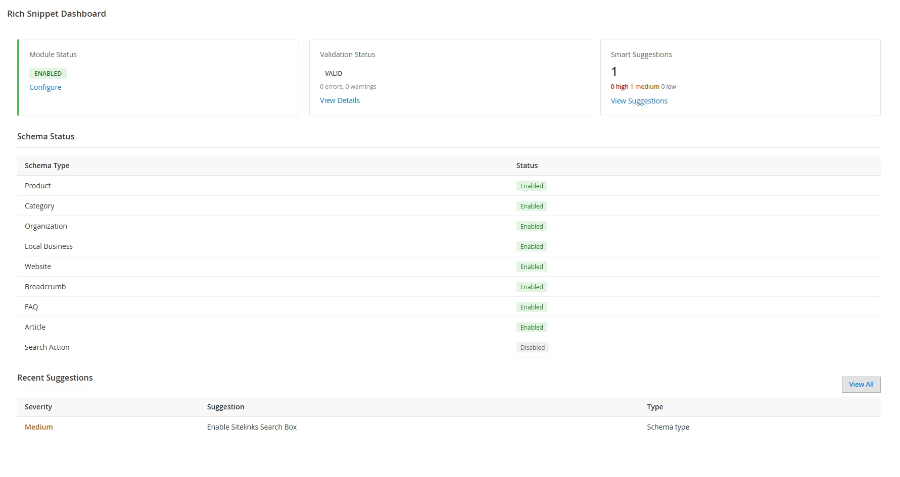

# Themestar Rich Snippet for Magento 2

Magento 2 module `Themestar_RichSnippet` that adds JSON-LD structured data (Schema.org) for SEO.

Themestar Rich Snippet for Magento 2 adds JSON-LD structured data for Products, Categories, Organization, LocalBusiness, Website, SearchAction & Breadcrumbs with price, stock, brand, reviews & ratings. Includes admin config, validation dashboard, suggestions, CLI checker & cron to fix errors and boost Google rich results, CTR and rankings.

Official download: https://oubpa.com/shop

This module is NOT distributed via GitHub. Download only from oubpa.com/shop.



## Download

1. Go to [https://oubpa.com/shop](https://oubpa.com/product/richsnippet-json-ld-structured-data-seo-rich-results-for-magento-2/)
2. Open the Themestar Rich Snippet product page
3. Click the link / Buy / Download button
4. Register an account on oubpa.com if you don't have one
5. Login, then download the module ZIP from your account / product page
6. Upload to your Magento installation as described below

No GitHub clone needed.

## License

Free License - Lifetime.

- 100% free for lifetime, no renewal, no expiry
- 1 license per Magento installation / domain unless stated otherwise on oubpa.com/shop
- You may use it on the store(s) allowed by the product terms on oubpa.com/shop
- Redistribution, resale, or publishing the ZIP / source code publicly (including GitHub) is not allowed
- Support and updates are provided via oubpa.com only

If you need the exact license text, check the product page on [https://oubpa.com/shop](https://oubpa.com/product/richsnippet-json-ld-structured-data-seo-rich-results-for-magento-2/).

## Features

- JSON-LD output via `Themestar\RichSnippet\Block\JsonLd`
- Schema types supported:
  - `Product` (price, availability, brand, review, rating, offer)
  - `Category`
  - `Organization`
  - `LocalBusiness` (configurable type)
  - `WebSite` + `SearchAction`
  - `BreadcrumbList`
  - `FAQ`, `Article` (config flags)
- Admin configuration: `Stores > Configuration > Themestar > Rich Snippet`
- Admin dashboard: validation results, suggestions, clear cache
- Validation:
  - CLI: `bin/magento themestar:richsnippet:validate`
  - Cron automatic validation
- Plugins for head / product / category / CMS injection

## Requirements

- Magento 2.4.x
- PHP 7.4+ / 8.x (per your Magento version)
- Dependencies: `Magento_Catalog`, `Magento_Store`, `Magento_Theme`, `Magento_Cms`, `Magento_Review`, `Magento_CatalogInventory`

## Installation

### 1. Extract downloaded ZIP into app/code

You must end with:

```
app/code/Themestar/RichSnippet/
```

Example from Magento root:

```bash
mkdir -p app/code/Themestar
# unzip the file downloaded from oubpa.com/shop to app/code/Themestar/RichSnippet
# verify:
# app/code/Themestar/RichSnippet/registration.php
# app/code/Themestar/RichSnippet/etc/module.xml
```

### 2. Enable module

```bash
php bin/magento module:enable Themestar_RichSnippet
php bin/magento setup:upgrade
php bin/magento setup:di:compile
php bin/magento setup:static-content:deploy -f
php bin/magento cache:clean
```

### 3. Configure

- Admin → Stores → Configuration → Themestar → Rich Snippet
- Set Organization / LocalBusiness name, URL, logo, email, telephone, address
- Enable/disable per type: Product, Category, Organization, LocalBusiness, Website, Breadcrumb, Search, FAQ, Article, Validation
- Frontend outputs JSON-LD in `<head>`

## Support

- Website: [https://oubpa.com/shop](https://oubpa.com/product/richsnippet-json-ld-structured-data-seo-rich-results-for-magento-2/)
- Create an account on oubpa.com, then contact via the shop contact / support page
- Include your Magento version, module version (`1.0.0`), and error logs

## Version

- `1.0.0`
